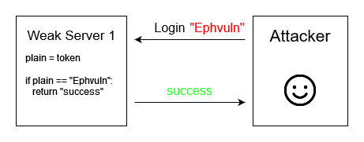

# Guide for the first homework of the cryptography course

This is an assigmnent for the cryptography course. We have to implement a known ciphertext attack + an oracle attack in a client-server model.
We are given the source code of the server, server.py. If we look at it, the server gives us 2 options:
  - get a guest token
  - send a token and verify it

To understand this better, I drew the server-attacker model:


So, the attacker gets the guest token, which corresponds to the guest user. Then, it generates new tokens, sends them to the server and checks if the server responds with "fail" or "success".

The final purpose is to send a login token to the server such that it responds with "success". In reality, the success message contains a secret flag.

Most of the time, the server will respond with a fail message:


The attacker wants the server to send a success message. If this happens, the attack will be over.


## A depper look into how the token is computed

In order to build an attack, we have to understand how the server encrypts the data. And see if the encryption protocol has a flaw.

The python source code related to how the token is built, looks like this:
```python
def encrypt(self, plain):
        rnd = self.C.encrypt(self.IV)
        cipher = byte_xor(plain, rnd) + SERVER_PUBLIC_BANNER + self.getIntegrity(plain)
        return cipher
```
It is an encrypt function, that receives a plaintext and returns the ciphertext. In our case, the plaintext is a username.

We'll say that our token is the cipher. As you can see, the token is made out of 3 parts:
  - the encrypted plaintext
  - a fixed public banner
  - an integrity tag
  


From e general perspective, the scheme is made such that:
   - generate a unique, secret token for a user
   - a user can request a token corresponding to its username
   - a user can send back the token to prove their identity
   - **a user can't generate a token for another user**

We want to somehow break the last checkpoint. 

## How does the server verify the token

Looking at the drawn attacker model, we see that the server receives a login/identity token from the attacker. Then it verifies it. If it returns true, the server will return "success". So in order to see how we can break the scheme, we need to understand the internals of the verification.

The verification in server.py depends on the decrypt function, that receives a token:
```python
def decrypt(self, input):
    rnd = self.C.encrypt(self.IV)
    secret_len = INTEGRITY_LEN + len(SERVER_PUBLIC_BANNER)
    cipher, secret, tag = input[:-secret_len], input[-secret_len:-INTEGRITY_LEN], input[-INTEGRITY_LEN:]
    plain = byte_xor(cipher, rnd)
    if secret != SERVER_PUBLIC_BANNER:
        return -1
    if self.getIntegrity(plain) != tag:
        return None

    return plain
```

As we can see, the the server:
  - splits the token in 3
  - xors the first part with `rnd=E(k, IV)`, which is the same that was used for generating the token
  - checks if the second part equals to SPB (SERVER_PUBLIC_TOKEN)
  - computes the integrity of the received plaintext
  - checks to see if the last part (the integrity tag) equals the computed integrity
  - if all the verifications succed, it returns the plaintext
 


But this is not all. The plaintext has to have some wanted value. That is the username of the user we want to impersonate. In our case, the server sends a "success" message when the username is "Ephvuln":
```python
def login():
  ...
  plain = C.decrypt(cipher)
  ...
  elif plain == b"Ephvuln":
      print("Secret:", FLAG)
  ...
```

So, we want to generate a token, such that the plaintext/username equals "Ephvuln".


Before breaking this, we'll look at weaker versions of the scheme, and see if we can break them.

## 1. Identity token scheme without encryption
The simplest scheme is just to send the unencrypted username:
```python
def encrypt(self, plain):
    cipher = plain
    return cipher
```

This is trivial to break, because the attacker can just send the target plaintext, "Ephvuln". The server will check that it equals to "Ephvuln" and return the flag.



## 2. Identity token scheme with xor encryption
The following scheme xors the plaintext with a pseudorandom block:
```python
def encrypt(self, plain):
    rnd = self.C.encrypt(self.IV)
    cipher = byte_xor(plain, rnd)

    return cipher
```
Pay attention that we're not using the public banner or the integrity tag, yet. This is just a plain xor.

The random block is generated by applying AES on a random string, with a random key. This should be secure, right?

This scheme is basically a OTP. So as long as its used once, we're fine. But in our attack model, the attacker gets a guest token. Then, it can send **other tokens**. Those tokens are decrypted using the same **random block**. THIS IS NOT SECURE!!!


Since the attacker can request the guest token, it means that he has access to a message-ciphertext pair. That is: the encryption of the guest username. By knowing these, he can generate a new cipheretext that decrypts to whatever he wants.

The attack is a known-plaintext attack with only one plantext-ciphertext pair. It is based on the properties of xor:


As you can see from the above picture, the attacker will send a ciphertext that will be decrypted to "Ephvuln". It constructs the ciphertext by xoring plaintext1 and ciphertex1; which are taken from the known plaintext-ciphertext pair.

$C_1 = E(k, IV) \oplus P_1$

If:

$C_2 = C_1 \oplus P_1 \oplus \text{"Ephvuln"}$

Then:

$P_2 = E(k, IV) \oplus C_2 = E(k, IV) \oplus C_1 \oplus P_1 \oplus \text{"Ephvuln"} = E(k, IV) \oplus E(k, IV) \oplus P_1 \oplus P_1 \oplus \text{"Ephvuln"}$

$P_2 = \text{"Ephvuln"}$

Conclusion: Identity token scheme with xor encryption is not enough.

## 3. Identity token scheme with AES encryption
We saw that the previous scheme was not secure for known plaintexts. The good thing is that we already have encryption algorithms that are thought to be secure agains known-plaintext attacks.

So, instead of xoring with a constant random block, the server can just encrypt the username with AES:
```python
def encrypt(self, plain):
    cipher = self.INTEGRITY.encrypt(plain)
        
    return cipher
```

This can stiil be broken if an attacker does a **bruteforce attack**.

The bruteforce approach would be viable if the text size is small enough. Currently, the text size for AES is 128 bits. Sadly, generating 2^128 messages is computationally **hard**.


Conclusion: Identity token scheme with AES encryption is not proven to be insecure.

## 4. Identity token scheme with truncated AES encryption
The upside (for the attacker) is that the server doesn't use the full AES encryption. It truncates the encrypted block:
```python
def encrypt(self, plain):
    cipher = self.INTEGRITY.encrypt(plain)[0:INTEGRITY_LEN]
        
    return cipher
```

If the integrity len is low enough, this can be broken with a bruteforce attack.


But this is not what the server does. It doesn't just truncate the plaintext.

## 5. Identity token scheme with xor encryption and integrity tag from truncated AES encryption
We'll look at the combination of schemes 2 and 4. Meaning: the encryption is done with xor. But the integrity is done by encrypting the plaintext with AES:
```python
def getIntegrity(self, plain):
    return self.INTEGRITY.encrypt(b'\x00' * (AES_KEY_SIZE - len(plain)) + plain)[0:INTEGRITY_LEN]
    
def encrypt(self, plain):
    cipher = byte_xor(plain, rnd) + self.getIntegrity(plain)
    return cipher
```

If we use the known-plaintext attack from 2, we can manipulate the first half of the cipher. But, we can't manipulate the second half. The server will check the integrity and say that it's wrong.


This means that if we want to change the cipher, we also have to change the integrity. We have to mention here that the integrity is generated exactly like in scheme 4: by encrypting the plaintext and truncating it.

So, to break the current scheme: the attacker has to generate a ciphertext from a known plain-ciphertext pair. After that, it will generate the token with every possible integrity block and send them to the server. One of the integrities should be the correct integrity for "Ephvuln":


Conclusion: the current scheme is succeptible to known-plaintext + bruteforce attack.

## Wrapping things up

We looked at variations of the token generation schemes. And we saw that xoring with constants is bad for doing one time things. Using small blocks is bad because we can bruteforce them.

The server's encryption scheme is similar to variation 5, that's descibed above. In addition, it inserts a SERVER PUBLIC BANNER in the middle, that's just a constant string.

After getting the guest token, the attacker knows the following:
  - The username of the guest: "Anonymous"
  - The guest token (and its lenght)
  - The wanted username: "Ephvuln"
  - The server.py source code

The things that the attacker doesn't know:
   - The SPB (Server Public Banner)
   - The length of the SPB
   - The length of the integrity
   - The integrity tag for "Ephvuln"

The attack has 3 main phases:
  1. Generate the ciphertext for "Ephvuln"
  2. Guess the length of the SPB or the integrity
  3. Bruteforce the integrity

That second step might sound a little like magic. The good thing is that the SPB is sent as plaintext. The problem: it's concatenated with integrity and we don't know either of their lengths.


Possible solution: try every length, starting for the SPB, from its maximum length. And, for each case, bruteforce the integrity. The shorter the SPB, the harder will be to get the integrity.

There is a better way than trying the bruteforce attack for each possible SPB length. But I'll let you find it ;)


The bruteforce, which is the **final attack**, looks like this:


